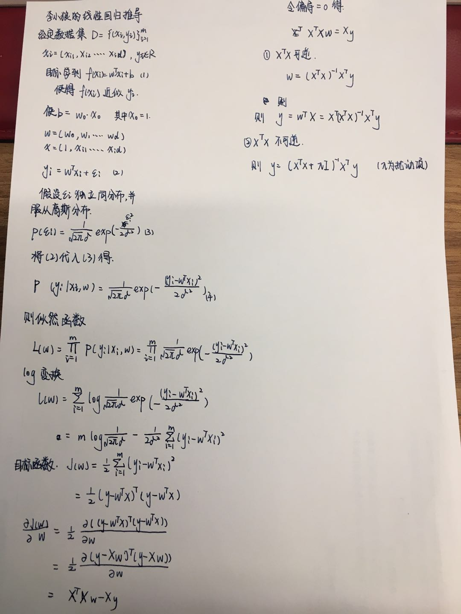

---
title:任务一
---

## 目录

[一、机器学习概念](#机器学习概念)

++[有监督的学习](#有监督的学习) 
------------------------------------------------
++[无监督学习](#无监督学习) 

++[泛化能力](#泛化能力) 

++[过拟合、欠拟合（方差和偏差以及各自解决办法）](#过拟合、欠拟合（方差和偏差以及各自解决办法)

++[交叉验证](#交叉验证) 

[二、线性回归原理](#线性回归原理)

[三、线性回归损失函数、代价函数、目标函数](#线性回归损失函数、代价函数、目标函数)

[四、优化方法](#优化方法)

[五、线性回归的评估指标](#线性回归的评估指标)

[六、sklearn参数详解](#sklearn参数详解)

-------------------------------------------------
# 机器学习概念

## **有监督的学习**

监督学习是指数据集的正确输出已知情况下的一类学习算法。因为输入和输出已知，意味着输入和输出之间有一个关系，监督学习算法就是要发现和总结这种“关系”。监督学习的任务是学习一个模型，使模型能够对任意给定的输入，对其相应的输出做出一个好的预测。

-------------------------------------------------

## **无监督学习**

无监督学习是指对无标签数据的一类学习算法。因为没有标签信息，意味着需要从数据集中发现和总结模式或者结构。我们基于数据中的变量之间关系利用聚类算法发现这种内在模式或者结构。

-------------------------------------------------

## **泛化能力**

学习方法的泛化能力是指由该方法学习到的模型对位置数据的预测能力，是学习方法本质上重要的性质。

现实中采用最多的办法是通过测试误差来评价学习方法的泛化能力。但这种评价是依赖于测试数据集的。 因为测试数据集是有限的， 很有可能由此得到的评价结果是不可靠的。 

统计学习理论试图从理论上对学习方法的泛化能力进行分析。

-------------------------------------------------

## **过拟合、欠拟合（方差和偏差以及各自解决办法）**

## 过拟合

#### 定义

所谓过拟合，指的是模型在训练集上表现的很好，但是在交叉验证集合测试集上表现一般，也就是说模型对未知样本的预测表现一般，泛化（generalization）能力较差。特征维度较多，导致拟合的函数完美的经过训练集，但是对新数据的预测结果则较差。
#### 解决方法

1.选取合适的停止训练标准，使对机器的训练在合适的程度。

2.保留验证数据集，对训练成果进行验证。

3.获取额外数据进行交叉验证。

4.正则化，即在进行目标函数或代价函数优化时，在目标函数或代价函数。

## 欠拟合
#### 定义
欠拟合是和过拟合相对的现象，可以说是模型的复杂度较低，没法很好的学习到数据背后的规律。

#### 解决方法

1.将模型复杂化。例如增加高次项，增加决策树深度等。

2.增加更多的特征，使输入数据具有更强的表达能力。

3.降低正则化的约束

------------------------------------------------

## **交叉验证**

#### 定义
如果给定的样本数据充足，进行模型选择的一种简单方法是随机地将数据切分成三部分。即 训练集、验证集、和测试集。训练集用来训练数据，验证集用来模型的选择，测试集用来最终对学习方法的评估。在学习到的不同复杂度的模型中，选择对验证集有最小预测误差的模型。由于验证集有足够多的数据，用它对模型进行选择也是有效的。

#### 类别
1.简单交叉验证

2.S折交叉验证

3.留一交叉验证

------------------------------------------------
------------------------------------------------
# 线性回归原理

如图所示

------------------------------------------------
------------------------------------------------
# 线性回归损失函数、代价函数、目标函数

## 线性回归损失函数
构建的损失函数为：
$$C=\sum_{k=1}^n(y_i-\overline{y})^2 $$

函数表示每一个训练点$(x_i,y_i)$到拟合直线$y_i=$θ$x_i$的竖直距离的平方和，通过最小化上面的损失函数可以求得拟合直线的最佳参数θ。 
这里的损失函数之所以使用平方形式，是使用了“最小二乘法”的思想，这里的“二乘”指的是用平方来度量观测点与估计点的距离（远近），“最小”指的是参数值要保证各个观测点与估计点的距离的平方和达到最小。 

## 代价函数
假设有训练样本(x, y)，模型为h，参数为θ。h(θ) = θTx（θT表示θ的转置）。

（1）概况来讲，任何能够衡量模型预测出来的值h(θ)与真实值y之间的差异的函数都可以叫做代价函数C(θ)，如果有多个样本，则可以将所有代价函数的取值求均值，记做J(θ)。因此很容易就可以得出以下关于代价函数的性质：

对于每种算法来说，代价函数不是唯一的；
代价函数是参数θ的函数；
总的代价函数J(θ)可以用来评价模型的好坏，代价函数越小说明模型和参数越符合训练样本(x, y)；
J(θ)是一个标量；
（2）当我们确定了模型h，后面做的所有事情就是训练模型的参数θ。那么什么时候模型的训练才能结束呢？这时候也涉及到代价函数，由于代价函数是用来衡量模型好坏的，我们的目标当然是得到最好的模型（也就是最符合训练样本(x, y)的模型）。因此训练参数的过程就是不断改变θ，从而得到更小的J(θ)的过程。理想情况下，当我们取到代价函数J的最小值时，就得到了最优的参数θ，记为：

$min$θ$J($θ$)$

例如，J(θ) = 0，表示我们的模型完美的拟合了观察的数据，没有任何误差。

（3）在优化参数θ的过程中，最常用的方法是梯度下降，这里的梯度就是代价函数J(θ)对θ1, θ2, ..., θn的偏导数。由于需要求偏导，我们可以得到另一个关于代价函数的性质：

选择代价函数时，最好挑选对参数θ可微的函数（全微分存在，偏导数一定存在）

## 目标函数
目标函数：优化的目标，可以是“损失函数”或者“损失函数+正则项”，分为经验风险最小化，结构风险最小化。就是代价函数 + 正则化项。

------------------------------------------------
------------------------------------------------
# 优化方法

## 牛顿法

牛顿法就是通过使原方程泰勒展开的一阶近似等于零不断获得更好的结果的求解方程零点的方法。
牛顿法是求解方程零点的方法。
牛顿法利用泰勒展开的一阶近似的零点获得更接近真实零点的点。
牛顿法通过迭代的方法不断的获得更好的解来求得最好的解。

## 拟牛顿法

在牛顿法的迭代中，需要计算Hesse 矩阵的逆矩阵$H^{-1}$,这一计算比较复杂，所以考虑用一个$n$阶矩阵$G_k=G(x^{(k)})$来近似替代${H_k}^{-1}=H^{-1}(x^{(k)})$,这就是拟牛顿法的基本思想。

DFP方法、BFGS方法以及L-BFGS算法都是重要的拟牛顿算法。

## 梯度下降法

梯度下降算法是求解无约束最优化问题的一种最常见的方法。有实现简单的优点。梯度下降法是迭代算法，每一步需要求解目标函数的梯度向量。
梯度下降法是一种迭代算法，选取适当的初值$x$,不断迭代，更新$x$值，进行目标函数的极小化，直到收敛。由于负梯度方向是使函数值下降最快的方向，在迭代的每一步，以负梯度方向更新$x$的值，从而达到减少函数值的目的。

------------------------------------------------
------------------------------------------------
# 线性回归的评估指标
SSE(和方差、误差平方和)：该统计参数计算的是拟合数据和原始数据对应点的误
差的平方和。$SSE=\sum_{i=1}^m(y_i-\overline{y_i})^2$

MSE(均方误差)：$MSE=\frac{1}{m}\sum_{i=1}^m(y_i-\overline{y_i})^2$该统计参数是预测数据和原始数据对应点误差的平方和的均值，也就是$SSE/n$.

RMSE(均方根、标准差)：该统计参数，也叫回归系统的拟合标准差，是MSE的平方根.$RMSE=\sqrt{\frac{1}{m}\sum_{i=1}^m(y_i-\overline{y_i})^2}$

MAE(平均绝对误差):$MAE=\frac{1}{m}\sum_{i=1}^m|(y_i-\overline{y_i})|$

R-square(确定系数)：$R^2=1-\frac{SSR}{SST}$

------------------------------------------------
------------------------------------------------
# sklearn参数详解

    sklearn.linear_model.LinearRegression(fit_intercept=True,normalize=False,copy_X=True,n_jobs=1)
参数详解：

### fit_intercept:默认为true

**说明**:是否对训练数据进行中心化。如果该变量为false，则表明输入的数据已经进行了中心化，在下面的过程里不进行中心化处理；否则，对输入的训练数据进行中心化处理

### normalize:默认为false

**说明**:是否对数据进行标准化处理

### copy_X:默认为true

**说明**:是否对X复制，如果选择false，则直接对原数据进行覆盖。（即经过中心化，标准化后，是否把新数据覆盖到原数据上）

### n_jobs:默认为1

**说明**:计算时设置的任务个数(number of jobs)。如果选择-1则代表使用所有的CPU。这一参数的对于目标个数>1（n_targets>1）且足够大规模的问题有加速作用。

------------------------------------------------
------------------------------------------------