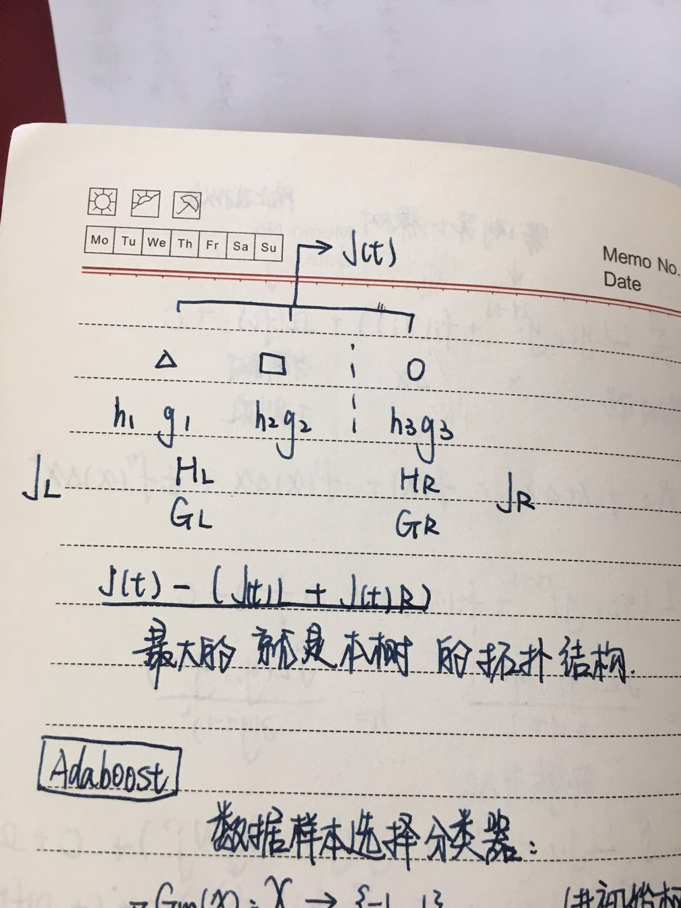

---
title:任务三
---

## 目录
------------------------------------------------
[一、信息论基础](#信息论基础)

[二、决策树的不同分类算法](#决策树的不同分类算法)

[三、回归树原理](#回归树原理)

[四、决策树防止过拟合手段](#决策树防止过拟合手段)

[五、模型评估](#模型评估)

[六、 sklearn参数详解，Python绘制决策树](#sklearn参数详解，Python绘制决策树)

-------------------------------------------------
# 信息论基础

## 熵 

熵描述了数据的混乱程度，熵越大，混乱程度越高，也就是纯度越低；反之，熵越小，混乱程度越低，纯度越高。 熵的计算公式如下所示：
$$Entropy=-\sum_{i=1}^n{p_i}*log(p_i)$$
其中Pi表示类i的数量占比。以二分类问题为例，如果两类的数量相同，此时分类节点的纯度最低，熵等于1；如果节点的数据属于同一类时，此时节点的纯度最高，熵等于0。

## 联合熵 

联合熵就是度量一个联合分布的随机系统的不确定度，下面给出两个随机变量的联合熵的定义：
分布为 p(x,y)p(x,y) 的一对随机变量 (X,Y)(X,Y) ,其联合熵定义为：
$H(X,Y)=-\sum_{x-in-X}\sum_{y-in-Y}p(x,y)=E[log\frac{1}{p(x,y)}]$

(注x-in-Y意思为x∈X，后面同理)

## 条件熵 

条件熵 H(Y|X) 表示在已知随机变量 X 的条件下随机变量 Y 的不确定性。条件熵 H(Y|X) 定义为 X 给定条件下 Y 的条件概率分布的熵对  X 的数学期望：
$$H(Y|X)=-\sum{p(x)}H(Y|X=x)$$
$$ =-\sum{p(x)}\sum_yp(y|x)logp(y|x)$$
$$ =-\sum_x\sum_yp(x,y)logp(y|x)$$
$$ =-\sum_{x,y}p(x,y)logp(y|x)$$

## 信息增益 

用信息增益表示分裂前后跟的数据复杂度和分裂节点数据复杂度的变化值，计算公式表示为：
$$InfoGain=Gain-\sum_{i=1}^n{Gain_i}$$
其中Gain表示节点的复杂度，Gain越高，说明复杂度越高。信息增益说白了就是分裂前的数据复杂度减去孩子节点的数据复杂度的和，信息增益越大，分裂后的复杂度减小得越多，分类的效果越明显。

## 基尼不纯度

------------------------------------------------
------------------------------------------------
# 决策树的不同分类算法

## ID3算法

ID3 算法的核心是在决策树各个节点上根据信息增益来选择进行划分的特征，然后递归地构建决策树。
### 具体方法
1.从根节点开始，对节点计算所有可能的特征的信息增益，选择信息增益值最大的特征作为节点的划分特征；

2.由该特征的不同取值建立子节点；

3.再对子节点递归地调用以上方法，构建决策树；

4.到所有特征的信息增益都很小或者没有特征可以选择为止，得到最终的决策树

## C4.5算法

C4.5 与ID3相似，但对ID3进行了改进，在这里不再详细描述C4.5的实现，就讲一下有哪些基于ID3的改进：

1.用信息增益率来选择划分特征，克服了用信息增益选择的不足

2.在构造树的过程中进行剪枝

3.可对连续值与缺失值进行处理
## CART分类树

CART(classificationandregressiontree), 分类回归树算法，既可用于分类也可用于回归，在这一部分我们先主要将其分类树的生成。区别于ID3和C4.5,CART假设决策树是二叉树，内部节点特征的取值为“是”和“否”，左分支为取值为“是”的分支，右分支为取值为”否“的分支。这样的决策树等价于递归地二分每个特征，将输入空间(即特征空间)划分为有限个单元。CART的分类树用基尼指数来选择最优特征的最优划分点，具体过程如下：
1.从根节点开始，对节点计算现有特征的基尼指数，对每一个特征，例如A，再对其每个可能的取值如a,根据样本点对A=a的结果的”是“与”否“划分为两个部分，利用Gini(D,A=a)=|D1||D|Gini(D1)+|D2||D|Gini(D2)进行计算；
2.在所有可能的特征A以及该特征所有的可能取值a中，选择基尼指数最小的特征及其对应的取值作为最优特征和最优切分点。然后根据最优特征和最优切分点，将本节点的数据集二分，生成两个子节点；
3.对两个字节点递归地调用上述步骤，直至节点中的样本个数小于阈值，或者样本集的基尼指数小于阈值，或者没有更多特征后停止；
4.生成CART分类树；

------------------------------------------------
------------------------------------------------
# 决策树原理（XGBT）

------------------------------------------------
------------------------------------------------
# 决策树防止过拟合手段

------------------------------------------------
------------------------------------------------
# 模型评估

模型评估是模型开发过程的不可或缺的一部分。它有助于发现表达数据的最佳模型和所选模型将来工作的性能如何。在数据挖掘中，使用训练集中的数据评估模型性能是不可接受的，因为这易于生成过于乐观和过拟合的模型。数据挖掘中有两种方法评估模型，验证（Hold-Out）和交叉验证（Cross-Validation）。为了避免过拟合，这两种方法都使用（模型没有遇到过的）测试集来评估模型性能。

评价分类器性能的指标一般是分类准确率，其定义是：对于给定的测试数据集，分类器正确分类的样本数与总样本数之比，也就是损失函数是0-1损失时测试数据集上的准确率。

对于二分类方法问题常用的评价指标是精确率和召回率，通常以关注的类为正类，其他类为负类，分类器在测试数据集上的预测或正确或不正确，4种情况出现的总数分别记作TP,FN,FP,TN。
精确率定义为：
$$P=\frac{TP}{TP+FP}$$
召回率定义为：
$$R=\frac{TP}{TP+FN}$$
此外，还有F1值：
$$F_1=\frac{2TP}{2TP+FP+FN}$$

------------------------------------------------
------------------------------------------------
# sklearn参数详解

    from sklearn.tree import DecisionTreeClassifier
    '''
    分类决策树
    '''
    DecisionTreeClassifier(criterion="gini",
                    splitter="best",
                    max_depth=None,
                    min_samples_split=2,
                    min_samples_leaf=1,
                    min_weight_fraction_leaf=0.,
                    max_features=None,
                    random_state=None,
                    max_leaf_nodes=None,
                    min_impurity_decrease=0.,
                    min_impurity_split=None,
                    class_weight=None,
                    presort=False)
    '''
    参数含义：
    1.criterion:string, optional (default="gini")
            (1).criterion='gini',分裂节点时评价准则是Gini指数。
            (2).criterion='entropy',分裂节点时的评价指标是信息增益。
    2.max_depth:int or None, optional (default=None)。指定树的最大深度。
            如果为None，表示树的深度不限。直到所有的叶子节点都是纯净的，即叶子节点
            中所有的样本点都属于同一个类别。或者每个叶子节点包含的样本数小于min_samples_split。
    3.splitter:string, optional (default="best")。指定分裂节点时的策略。
            (1).splitter='best',表示选择最优的分裂策略。
            (2).splitter='random',表示选择最好的随机切分策略。
    4.min_samples_split:int, float, optional (default=2)。表示分裂一个内部节点需要的做少样本数。
            (1).如果为整数，则min_samples_split就是最少样本数。
            (2).如果为浮点数(0到1之间)，则每次分裂最少样本数为ceil(min_samples_split * n_samples)
    5.min_samples_leaf: int, float, optional (default=1)。指定每个叶子节点需要的最少样本数。
            (1).如果为整数，则min_samples_split就是最少样本数。
            (2).如果为浮点数(0到1之间)，则每个叶子节点最少样本数为ceil(min_samples_leaf * n_samples)
    6.min_weight_fraction_leaf:float, optional (default=0.)
            指定叶子节点中样本的最小权重。
    7.max_features:int, float, string or None, optional (default=None).
            搜寻最佳划分的时候考虑的特征数量。
            (1).如果为整数，每次分裂只考虑max_features个特征。
            (2).如果为浮点数(0到1之间)，每次切分只考虑int(max_features * n_features)个特征。
            (3).如果为'auto'或者'sqrt',则每次切分只考虑sqrt(n_features)个特征
            (4).如果为'log2',则每次切分只考虑log2(n_features)个特征。
            (5).如果为None,则每次切分考虑n_features个特征。
            (6).如果已经考虑了max_features个特征，但还是没有找到一个有效的切分，那么还会继续寻找
            下一个特征，直到找到一个有效的切分为止。
    8.random_state:int, RandomState instance or None, optional (default=None)
            (1).如果为整数，则它指定了随机数生成器的种子。
            (2).如果为RandomState实例，则指定了随机数生成器。
            (3).如果为None，则使用默认的随机数生成器。
    9.max_leaf_nodes: int or None, optional (default=None)。指定了叶子节点的最大数量。
            (1).如果为None,叶子节点数量不限。
            (2).如果为整数，则max_depth被忽略。
    10.min_impurity_decrease:float, optional (default=0.)
            如果节点的分裂导致不纯度的减少(分裂后样本比分裂前更加纯净)大于或等于min_impurity_decrease，则分裂该节点。
            加权不纯度的减少量计算公式为：
            min_impurity_decrease=N_t / N * (impurity - N_t_R / N_t * right_impurity
                            - N_t_L / N_t * left_impurity)
            其中N是样本的总数，N_t是当前节点的样本数，N_t_L是分裂后左子节点的样本数，
            N_t_R是分裂后右子节点的样本数。impurity指当前节点的基尼指数，right_impurity指
            分裂后右子节点的基尼指数。left_impurity指分裂后左子节点的基尼指数。
    11.min_impurity_split:float
            树生长过程中早停止的阈值。如果当前节点的不纯度高于阈值，节点将分裂，否则它是叶子节点。
            这个参数已经被弃用。用min_impurity_decrease代替了min_impurity_split。
    12.class_weight:dict, list of dicts, "balanced" or None, default=None
            类别权重的形式为{class_label: weight}
            (1).如果没有给出每个类别的权重，则每个类别的权重都为1。
            (2).如果class_weight='balanced'，则分类的权重与样本中每个类别出现的频率成反比。
            计算公式为：n_samples / (n_classes * np.bincount(y))
            (3).如果sample_weight提供了样本权重(由fit方法提供)，则这些权重都会乘以sample_weight。
    13.presort:bool, optional (default=False)
        指定是否需要提前排序数据从而加速训练中寻找最优切分的过程。设置为True时，对于大数据集
        会减慢总体的训练过程；但是对于一个小数据集或者设定了最大深度的情况下，会加速训练过程。
 

------------------------------------------------
------------------------------------------------

参考：

https://www.cnblogs.com/yonghao/p/5061873.html

https://blog.csdn.net/weixin_36586536/article/details/80468426

https://blog.csdn.net/qq_16000815/article/details/80954039

https://blog.csdn.net/Sakura55/article/details/80786499 